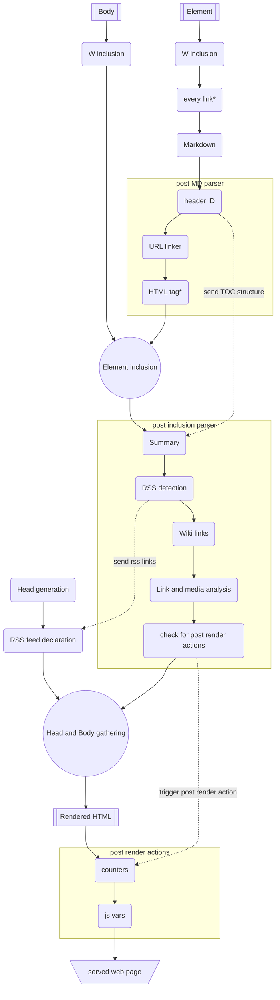

W render engine scheme
======================

This diagram represent W rendering chain.

- *every link: rendering option that transform every word as a link
- *HTML tag: [rendering option](MANUAL.md#html-tags) that does not print Element's corresponding HTML tags (only for pages V1)

## W inclusions

List of W inclusions

1. replace `%DATE%`, `%DATEMODIF%`, `%TIME%`, `%TIMEMODIF%` codes
1. replace `%THUMBNAIL%` code
1. replace `%PAGEID%` and `%ID%` code
1. replace `%URL%` code
1. replace `%PATH%` code
1. replace `%TITLE%` code
1. replace `%DESCRIPTION%` code
1. replace `%LIST%` code
1. replace `%MEDIA%` code
1. replace `%MAP%` code
1. replace `%RANDOM%` code
1. replace `%AUTHORS%` code
1. replace `%CONNECT%` code

The point of doing those inclusions early is to be before __Header ID__ parser. That way, when they are used inside HTML headings, they will generate nicer IDs.
